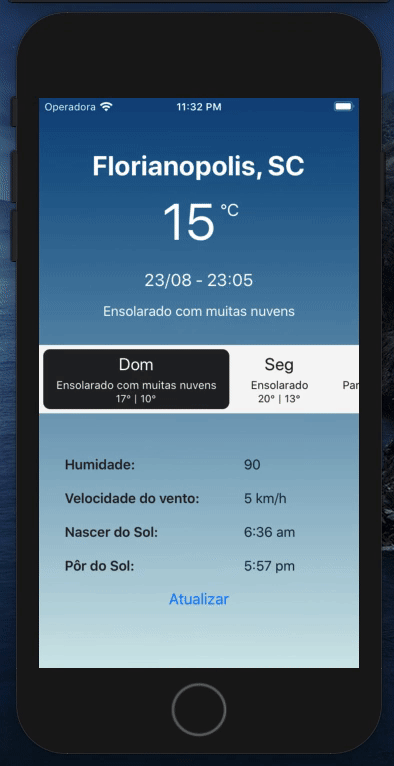

## Weather APP - React-Native

###### API: api.hgbrasil.com



## Observação:

```
- O idioma do aparelho deve estar em Português
- Adicionar as coordenadas de longitude e latitude manualmente em cada emulador (ios/android). Caso contrário, a API tentará usar o ip do usuário.
```

## Instalação

```
npm run watch:clean
npm run install:clean
```

## IOS/Android

```
npm run ios
npm run android
```

## Testes (básico) e ESLint (básico),

```
npm test
npm lint
```
